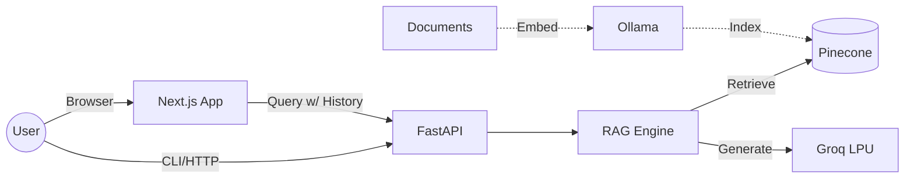

# ⚖️ US Copyright Law RAG

A high-performance **Retrieval-Augmented Generation (RAG)** system built for querying **US Code Title 17 (Copyrights)**.

Now updated with a modern **React/Next.js UI**, context-aware chat, and real-time citing.

## 🏗️ Architecture



## 🚀 Features

- **⚡ Instant Inference**: Powered by Groq's LPU (`openai/gpt-oss-120b`).
- **💬 Chat Interface**: Modern Web UI with history, dark mode, and file icons.
- **🔍 Semantic Search**: Pinecone vector database with reliable indexing.
- **🌐 REST API**: Context-aware `POST /query` endpoint.
- **📊 Traceability**: Full JSON logging of queries, retrieved chunks, and timing.

## ⚡ Quick Start

### 1. Prerequisites

- Python 3.11+ & Node.js 18+
- [uv](https://github.com/astral-sh/uv) (recommended)
- [Docker Desktop](https://www.docker.com/) (Required for local embeddings)

### 2. Start Services (3 Terminals)

**Terminal 1: AI Engine (Ollama)**

```bash
# Start Docker container
docker start ollama
# OR if first run: docker compose up -d
```

**Terminal 2: API Backend**

```bash
# Install Python dependencies and run server
uv sync
uv run uvicorn src.law_rag.api:app --reload --port 8000
```

**Terminal 3: Frontend UI**

```bash
# Install Node dependencies and run dev server
cd frontend
npm install
npm run dev
```

Visit **http://localhost:3000** (or 3001/3002) to use the application.

### 4. CLI Usage

**Interactive Chat**

```bash
uv run python -m src.law_rag.main
```

**Ingest Data** (Required first run)

```bash
uv run python -m src.law_rag.main --ingest
```

## 🌐 API Reference

### POST `/query`

Query the RAG system with chat history.

- **Swagger UI**: `http://localhost:8000/docs`
- **Health Check**: `http://localhost:8000/health`

## ⚙️ Configuration

Settings are managed in `src/law_rag/config.py` and `.env`.

| Component |Default                | Description         |
| :-------- | :-------------------- | :------------------ |
| **LLM**   | `openai/gpt-oss-120b` | LLM Model ID        |
| **Index** | `1024`                | Indexing chunk size |
| **RAG**   | `5`                   | Retrieval depth     |

## 🛠️ Tech Stack

- **Frontend**: Next.js 16, Tailwind CSS, Lucide
- **Backend**: FastAPI, LlamaIndex
- **AI**: Groq (LLM), Pinecone (Vector DB), Ollama (Embeddings)
