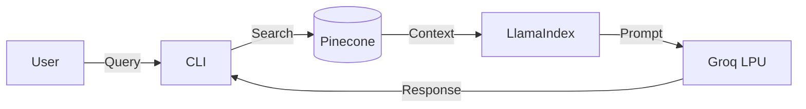

# ⚖️ US Copyright Law RAG Assistant

A high-performance RAG system for **US Code Title 17 (Copyrights)**, leveraging **Groq** for speed, **Pinecone** for serverless retrieval, and **LlamaIndex** for orchestration.

---

## 🚀 Features

- **Instant Inference**: Powered by Groq's LPU (`openai/gpt-oss-120b`).
- **Semantic Search**: Pinecone vector database with reliable indexing.
- **Traceability**: Full JSON logging of queries, retrieved chunks, and metadata.
- **Modern Stack**: Built on Python 3.12+ and managed by `uv`.

## 🏗️ Architecture



## 🛠️ Tech Stack

| Component      | Technology                               | Details                    |
| :------------- | :--------------------------------------- | :------------------------- |
| **LLM**        | [Groq](https://groq.com)                 | `openai/gpt-oss-120b`      |
| **Vector DB**  | [Pinecone](https://pinecone.io)          | Serverless (AWS us-east-1) |
| **Embeddings** | [Ollama](https://ollama.com)             | `embeddinggemma` (Local)   |
| **Framework**  | [LlamaIndex](https://www.llamaindex.ai/) | Orchestration & RAG        |
| **Manager**    | [uv](https://github.com/astral-sh/uv)    | Dependency Management      |

## ⚡ Quick Start

### 1. Prerequisites

- Python 3.11+
- [uv](https://github.com/astral-sh/uv) (recommended)
- [Docker Desktop](https://www.docker.com/)
- API Keys: **Groq**, **Pinecone**

### 2. Start Ollama

Start Ollama with persistent storage using Docker Compose:

```bash
docker compose up -d
docker exec ollama ollama pull embeddinggemma:latest
```

### 2. Installation

```bash
git clone https://github.com/galalqassas/USLaw-expert-RAG.git
cd USLaw-expert-RAG
uv sync
```

### 3. Configuration

Create `.env` with your credentials:

```ini
GROQ_API_KEY=gsk_...
PINECONE_API_KEY=pcsk_...
PINECONE_INDEX_NAME=law-rag-index
```

### 4. Usage

**Index Data (First Run)**

```bash
uv run python -m src.main --ingest
```

**Chat Interface**

```bash
uv run python -m src.main
```

**Single Query**

```bash
uv run python -m src.main -q "What is fair use?"
```

## ⚙️ Configuration (`src/config.py`)

| Setting               | Default               | Description         |
| :-------------------- | :-------------------- | :------------------ |
| `groq.model`          | `openai/gpt-oss-120b` | LLM Model ID        |
| `groq.context_window` | `131072`              | 128k Context Window |
| `chunking.chunk_size` | `1024`                | Indexing chunk size |
| `similarity_top_k`    | `5`                   | Retrieval depth     |
