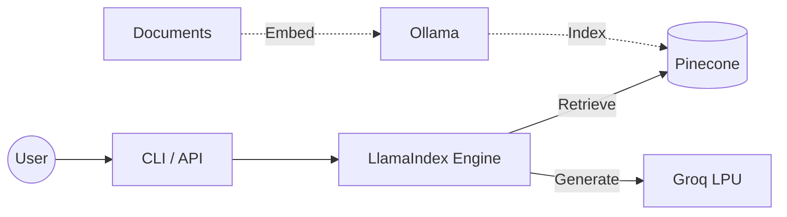

# ⚖️ US Copyright Law RAG

A high-performance **Retrieval-Augmented Generation (RAG)** system built for querying **US Code Title 17 (Copyrights)**.

Uses **Groq** for lightning-fast inference, **Pinecone** for scalable serverless retrieval, and **LlamaIndex** for robust orchestration.

---

## 🏗️ Architecture



## 🚀 Features

- **⚡ Instant Inference**: Powered by Groq's LPU (`openai/gpt-oss-120b`).
- **🔍 Semantic Search**: Pinecone vector database with reliable indexing.
- **🌐 REST API**: Production-ready FastAPI interface.
- **📊 Traceability**: Full JSON logging of queries, retrieved chunks, and timing.

## ⚡ Quick Start

### 1. Prerequisites

- Python 3.11+
- [uv](https://github.com/astral-sh/uv) (recommended)
- [Docker Desktop](https://www.docker.com/) for Ollama

### 2. Setup

Start Ollama and pull the embedding model:

```bash
docker compose up -d
docker exec ollama ollama pull embeddinggemma:latest
```

Install dependencies:

```bash
git clone https://github.com/galalqassas/USLaw-expert-RAG.git
cd USLaw-expert-RAG
uv sync
```

### 3. Usage

#### 🖥️ CLI Mode

**Interactive Chat**

```bash
uv run python -m law_rag.main
```

**Single Query**

```bash
uv run python -m law_rag.main -q "What is fair use?"
```

**Ingest Data**

```bash
uv run python -m law_rag.main --ingest
```

#### 🌐 API Server

Start the server:

```bash
uv run uvicorn law_rag.api:app --reload
```

- **Swagger UI**: `http://127.0.0.1:8000/docs`
- **Health Check**: `http://127.0.0.1:8000/health`

#### 🧪 Testing

Run the test suite:

```bash
uv run pytest tests/ -v
```

## ⚙️ Configuration

Settings are managed in `src/law_rag/config.py` and `.env`.

| Component | Setting               | Default               | Description         |
| :-------- | :-------------------- | :-------------------- | :------------------ |
| **LLM**   | `groq.model`          | `openai/gpt-oss-120b` | LLM Model ID        |
| **LLM**   | `groq.context_window` | `131072`              | 128k Context Window |
| **Index** | `chunking.chunk_size` | `1024`                | Indexing chunk size |
| **RAG**   | `similarity_top_k`    | `5`                   | Retrieval depth     |

## 🛠️ Tech Stack

- **LLM**: [Groq](https://groq.com)
- **Vector DB**: [Pinecone](https://pinecone.io)
- **Embeddings**: [Ollama](https://ollama.com)
- **Framework**: [LlamaIndex](https://www.llamaindex.ai/)
- **API**: [FastAPI](https://fastapi.tiangolo.com/)
